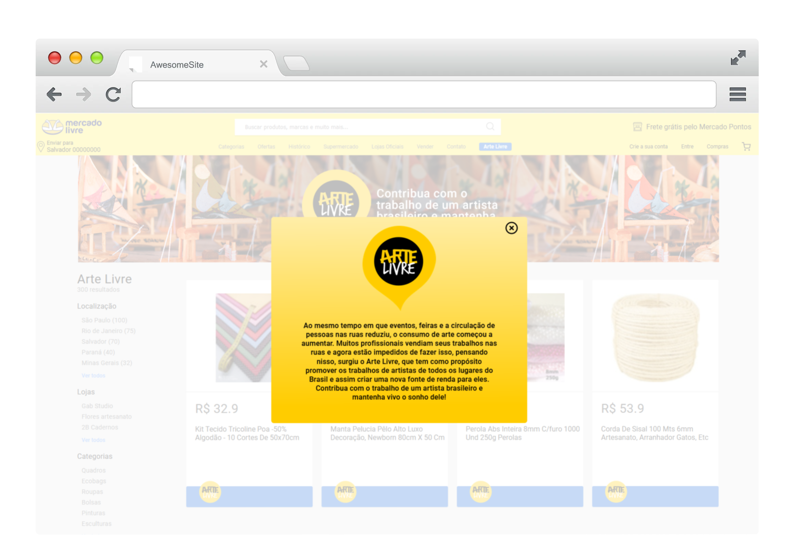
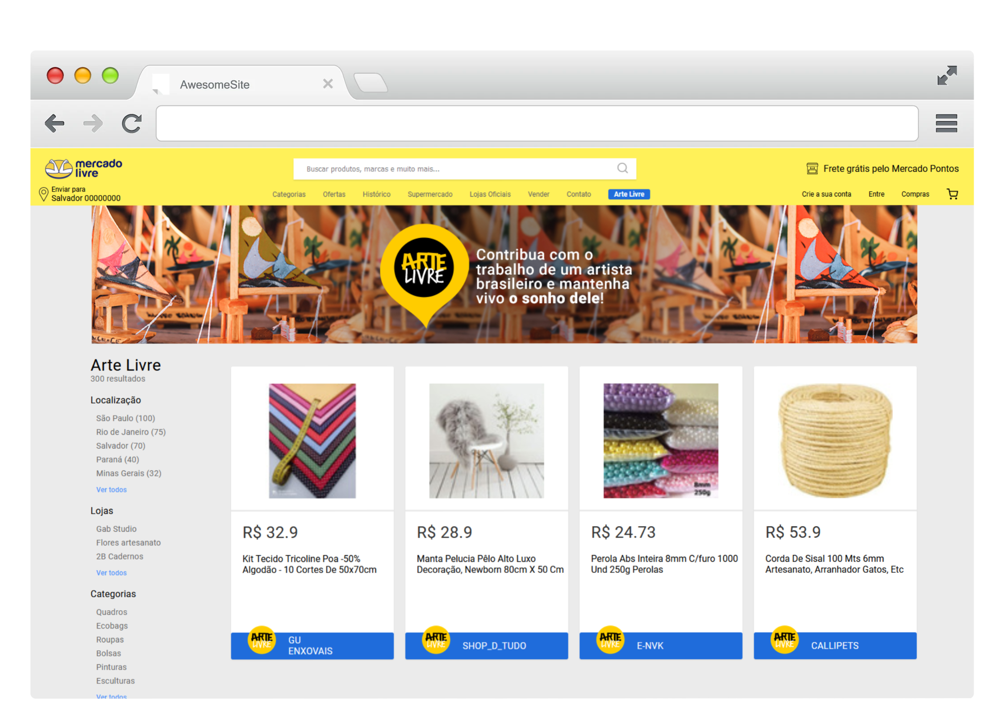
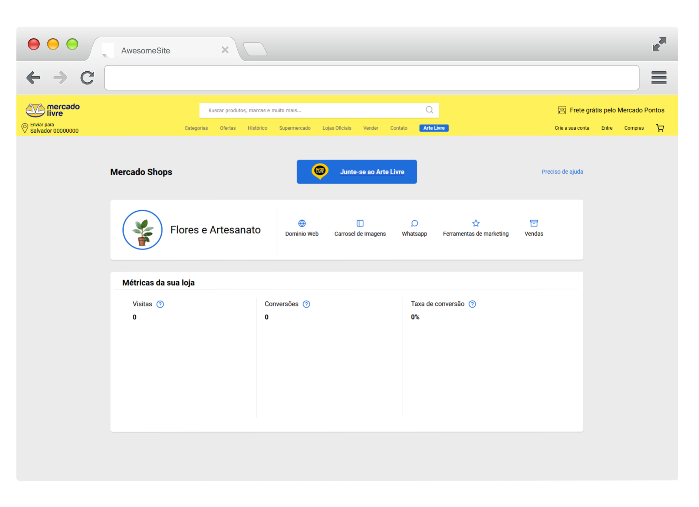
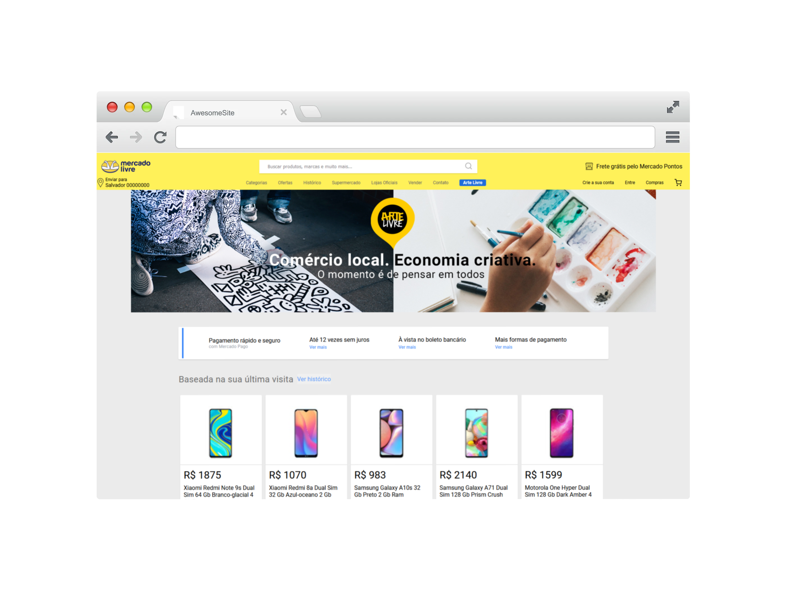

<h1 align="center">
    Arte Livre
</h1>

<h2 align="center"> O projeto Arte livre foi desenvolvido pelo Time 25 para o desafio do Mercado Livre do MegaHack 3.0. </h2>

## Sobre

O Arte Livre é uma ação de marketing e plataforma dentro do Mercado Livre voltada para o viés social e solidário. O Arte Livre tem como finalidade apoiar e promover de forma justa os profissionais que trabalham com com a economia criativa do país e foram afetados pela pandemia. São eles: os artesãos de pequenas comunidades nos interiores do Brasil, profissionais que trabalham com a criatividade e comércios locais do mesmo setor. A plataforma vai permitir maior alcance, reconhecimento, divulgação e vendas desses pequenos comerciantes.

## Time

- Brenda Andrade - UX/UI Deseign
- Giovany Nogueira - Business/Marketing
- Bruna Andrade - Desenvolvedora
- Leonardo Sena - Desenvolvedor
- Tárcio Carvalho - Desenvolvedor

## Aplicação

  
  
  
  

## Desenvolvimento

O projeto Arte Livre foi desenvolvimento utilizando a linguagem JavaScript e o framework React.js, além de utilizar HTML e CSS para toda a esturura da página. 
Para inicializar o projeto é preciso utilizar o comando abaixo:

### `yarn start`

Roda a aplicação no ambiente de desenvolvimento. 
A aplicação irá abrir no dominio: [http://localhost:3000](http://localhost:3000) para visualização no browser.
